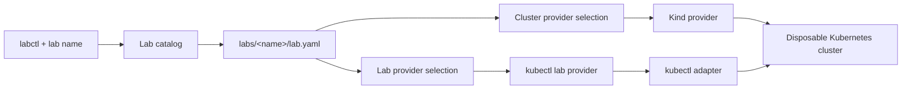

# Kubernetes System Labs

Kubernetes System Labs is a failure-oriented lab runner for learning how Kubernetes behaves when workloads, nodes, networking, storage, and infrastructure fail.

Each lab declares:

- the cluster topology it needs;
- the providers that create the cluster and run the lab;
- the Kubernetes manifests that create the scenario;
- the observable condition that means the scenario is ready to investigate.

`labctl` provisions an isolated environment, installs the scenario, waits until the intended symptom is visible, and removes both the lab resources and cluster when requested.

## Purpose

The repository is designed for investigation rather than command memorization. A lab should let the learner:

1. Observe a realistic symptom.
2. Form and test hypotheses.
3. Narrow the failure domain.
4. Identify the root cause.
5. Mitigate the failure.
6. Verify recovery.
7. Explain how to prevent recurrence.

The checked-in lab definition is the repeatable experiment. The learner investigates the resulting cluster.

## Prerequisites

| Tool | Purpose |
|---|---|
| Go 1.24 or newer | Build `labctl`, Mage, and provider tools |
| Docker | Run Kind node containers |
| `kubectl` | Apply lab resources and inspect Kubernetes state |
| Mage 1.17.2 or newer | Install provider tools, check the repository, and install `labctl` |

Docker must be installed and running before starting a lab. Kind is installed by the Mage provider setup rather than treated as a manual prerequisite.

## Setup

### 1. Install Mage

Unix and macOS:

```console
go install github.com/magefile/mage@v1.17.2
GOBIN="$(go env GOBIN)"; [ -n "$GOBIN" ] || GOBIN="$(go env GOPATH)/bin"
export PATH="$GOBIN:$PATH"
mage -version
```

Windows PowerShell:

```powershell
go install github.com/magefile/mage@v1.17.2
$goBin = go env GOBIN
if (-not $goBin) { $goBin = Join-Path (go env GOPATH) "bin" }
$env:Path = "$goBin;$env:Path"
mage -version
```

The `PATH` changes above apply to the current shell. Add the resolved Go binary directory to the user or shell profile `PATH` to make `mage` and `labctl` available in future shells.

### 2. Install golangci-lint

Install the pinned golangci-lint v2.14.0 binary by following the [official installation guide](https://golangci-lint.run/docs/welcome/install/local/). The official binary is preferred over building the tool from source.

Unix, macOS, and Git Bash on Windows:

```console
GOBIN="$(go env GOBIN)"; [ -n "$GOBIN" ] || GOBIN="$(go env GOPATH)/bin"
curl -sSfL https://golangci-lint.run/install.sh | sh -s -- -b "$GOBIN" v2.14.0
golangci-lint version
```

### 3. Install kubectl

`kubectl` is a prerequisite because `labctl start` and `labctl delete` check for it immediately after validating command arguments, before loading a lab or selecting providers. `labctl list` does not require access to a cluster.

Linux amd64:

```console
curl -LO "https://dl.k8s.io/release/$(curl -L -s https://dl.k8s.io/release/stable.txt)/bin/linux/amd64/kubectl"
curl -LO "https://dl.k8s.io/release/$(curl -L -s https://dl.k8s.io/release/stable.txt)/bin/linux/amd64/kubectl.sha256"
echo "$(cat kubectl.sha256)  kubectl" | sha256sum --check
sudo install -o root -g root -m 0755 kubectl /usr/local/bin/kubectl
```

macOS with Homebrew:

```console
brew install kubectl
```

Windows with WinGet:

```powershell
winget install --exact --id Kubernetes.kubectl
```

Other architectures and package managers are covered by the official [kubectl installation guide](https://kubernetes.io/docs/tasks/tools/#kubectl).

Verify the prerequisites:

```console
go version
docker info
kubectl version --client
mage -version
golangci-lint version
```

### 4. Install provider tools and labctl

Choose the providers explicitly:

```console
mage install -cluster=kind -lab=kubectl
```

This command:

1. Verifies the selected providers and the `kubectl` prerequisite.
2. Installs Kind into `GOBIN`, or the first `GOPATH/bin` when `GOBIN` is unset.
3. Runs `go test ./...` and `golangci-lint run`.
4. Builds and installs `labctl` into the same Go binary directory.
5. Runs `labctl list`.

To install or verify only the selected provider tools:

```console
mage providers -cluster=kind -lab=kubectl
```

Supported selections are `kind` for `-cluster` and `kubectl` for `-lab`. Both flags default to those values when omitted. Unsupported values fail without falling back to another provider.

### Mage targets

| Target | Behavior |
|---|---|
| `mage providers -cluster=kind -lab=kubectl` | Install selected provider tools and verify their prerequisites |
| `mage lint` | Run golangci-lint with `.golangci.yml` |
| `mage check` | Run tests and static analysis |
| `mage build` | Build the platform-specific `labctl` executable under `.labctl/build/` |
| `mage install -cluster=kind -lab=kubectl` | Run provider setup and checks, then install `labctl` and list the labs |
| `mage labs` | Run `labctl list` using the installed executable |

## Quick start

From the repository root, list and start a lab:

```console
labctl list
labctl start image-pull-backoff
```

`labctl` discovers the nearest ancestor containing `labs/`, so the commands also work from descendant directories. It resolves `image-pull-backoff` to `labs/image-pull-backoff/lab.yaml`, creates a Kind cluster with one control-plane node and one worker, applies the lab manifest, and waits for the Pod to enter `ImagePullBackOff`. Generated state remains under the repository root.

A ready lab reports structured output similar to:

```text
level=INFO msg="lab ready" lab=image-pull-backoff namespace=default pod=broken-image waiting_reason=ImagePullBackOff
```

Kind and kubectl standard output is logged at `INFO`; standard error is logged at `ERROR`, keeping provider command output in the same structured stream.

Use the generated kubeconfig to investigate:

```console
kubectl --kubeconfig .labctl/image-pull-backoff/kubeconfig get pods
kubectl --kubeconfig .labctl/image-pull-backoff/kubeconfig describe pod broken-image
kubectl --kubeconfig .labctl/image-pull-backoff/kubeconfig get events --sort-by=.lastTimestamp
```

Delete the lab resources and cluster:

```console
labctl delete image-pull-backoff
```

## CLI

```text
labctl <list|start|delete> [lab-name]
```

| Command | Behavior |
|---|---|
| `list` | Strictly loads every definition under `labs/` and lists its name, providers, and worker count |
| `start <lab-name>` | Resolves the lab by name, creates its cluster, applies its manifests, and waits for the configured readiness condition |
| `delete <lab-name>` | Deletes lab manifests in reverse order, then deletes the cluster and generated runtime state |

During development, invoke the same commands without installing the binary:

```console
go run ./cmd/labctl list
go run ./cmd/labctl start image-pull-backoff
```

## Available labs

| Lab | Cluster topology | Intended symptom | Ready condition |
|---|---|---|---|
| [`image-pull-backoff`](labs/image-pull-backoff/) | 1 control plane, 1 worker | A Pod cannot pull its configured image | Pod container reports `ImagePullBackOff` |

### Image pull failure

The lab uses the guaranteed-invalid image reference:

```text
registry.invalid/k8s-system-labs/does-not-exist:v1
```

The learner can investigate image resolution, Pod conditions, container state, and Kubernetes events without the runner revealing the diagnosis workflow.

## Providers

Cluster and lab providers have separate responsibilities and are selected explicitly in each lab.

### Cluster providers

| Provider | Status | Responsibility |
|---|---|---|
| `kind` | Available | Create the requested local cluster topology, generate its kubeconfig, resolve runtime cluster state, and delete the cluster |

### Lab providers

| Provider | Status | Responsibility |
|---|---|---|
| `kubectl` | Available | Apply manifests, observe Pod readiness, and delete manifests |

The selection is unambiguous:

```yaml
spec:
  providers:
    cluster: kind
    lab: kubectl
```

Unsupported provider names are rejected before any cluster is created.

## Lab definition

The current lab API is `labs.k8s-system-labs/v1alpha1`.

```yaml
apiVersion: labs.k8s-system-labs/v1alpha1
kind: Lab
metadata:
  name: image-pull-backoff
spec:
  providers:
    cluster: kind
    lab: kubectl
  cluster:
    name: image-pull-backoff
    workers: 1
  manifests:
    - pod.yaml
  ready:
    timeout: 2m
    pod:
      namespace: default
      name: broken-image
      waitingReason: ImagePullBackOff
```

Paths in `spec.manifests` are resolved relative to the lab definition. Unknown YAML fields and invalid definitions are rejected.

### Fields

| Field | Meaning |
|---|---|
| `metadata.name` | Stable lab identifier |
| `spec.providers.cluster` | Cluster lifecycle implementation |
| `spec.providers.lab` | Lab lifecycle implementation |
| `spec.cluster.name` | Provider-specific cluster name |
| `spec.cluster.workers` | Number of Kind worker nodes; one control-plane node is always created |
| `spec.manifests` | Ordered manifests applied when the lab starts and deleted in reverse order |
| `spec.ready.timeout` | Maximum time to wait for the expected symptom |
| `spec.ready.pod` | Pod and waiting reason that establish scenario readiness |

Provider selection remains explicit because it changes execution semantics. Defaults are better reserved for low-risk fields such as polling intervals or namespaces.

## Lifecycle and architecture



Starting a lab:

1. Validate command arguments.
2. Confirm `kubectl` is available.
3. Discover the repository and resolve the lab name to its `lab.yaml`.
4. Strictly decode and validate the lab YAML.
5. Select the lab and cluster providers.
6. Create the cluster and kubeconfig.
7. Apply the lab manifests.
8. Wait until the configured symptom is observable.

Deleting a lab:

1. Resolve the cluster kubeconfig.
2. Delete the lab manifests.
3. Delete the cluster even if manifest cleanup fails.
4. Remove generated cluster state.

## Repository structure

```text
magefile.go                     Provider setup, checks, build, and installation
cmd/labctl/                     CLI entrypoint and commands
internal/catalog/               Repository discovery and lab-name resolution
internal/domain/                Lab, provider selection, cluster, and readiness models
internal/loader/yaml/           Strict lab YAML loader
internal/provider/cluster/      Cluster provider contract and implementations
internal/provider/lab/          Lab provider contract and implementations
internal/kubernetes/kubectl/    kubectl process adapter
internal/logging/               Shared structured logging fields
labs/                           Versioned lab definitions and manifests
```

## Adding a lab

1. Create `labs/<lab-name>/`.
2. Add a `lab.yaml` using the current API version.
3. Add the Kubernetes manifests referenced by the definition.
4. Choose the required cluster and lab providers explicitly.
5. Define an observable readiness condition that proves the intended symptom exists.
6. Run `labctl start <lab-name>` and confirm the scenario is ready.
7. Run `labctl delete <lab-name>` and confirm all generated resources are removed.

A readiness check should establish the symptom without encoding the expected fix. This allows multiple valid remediations.

## Safety and local state

- Labs execute Kubernetes manifests from the repository. Review third-party lab content before running it.
- The current Kind provider creates disposable local clusters; do not treat generated clusters as persistent environments.
- Runtime files are written beneath `.labctl/<cluster-name>/`.
- Generated kubeconfigs contain cluster credentials and are excluded by `.gitignore`.
- If setup fails, the cluster is intentionally retained for inspection. Run `labctl delete` when finished.

## Current limitations

- Only the Kind cluster provider is implemented.
- Only the kubectl lab provider is implemented.
- Cluster topology is one control-plane node plus a configurable worker count.
- Readiness currently supports one Pod container waiting reason.
- There are no `status` or `reset` commands.
- Existing or remote clusters cannot yet be attached as targets.

The provider boundaries allow additional cluster implementations and lab delivery mechanisms, such as a custom Kubernetes platform, Kustomize, or Helm, without changing existing lab definitions.

## AI assistance

AI assistance should preserve the investigation. During an active lab, it should provide requested evidence, clarify concepts, challenge hypotheses, and review conclusions without revealing the root cause or prescribing the next command unless explicitly requested.

## Development

Run the repository checks or build a local binary with Mage:

```console
mage check
mage build
```

`mage check` runs the test suite and the pinned golangci-lint v2 configuration. `mage build` writes the platform-specific executable to `.labctl/build/`. The checks remain available directly:

```console
go test ./...
golangci-lint run
```
